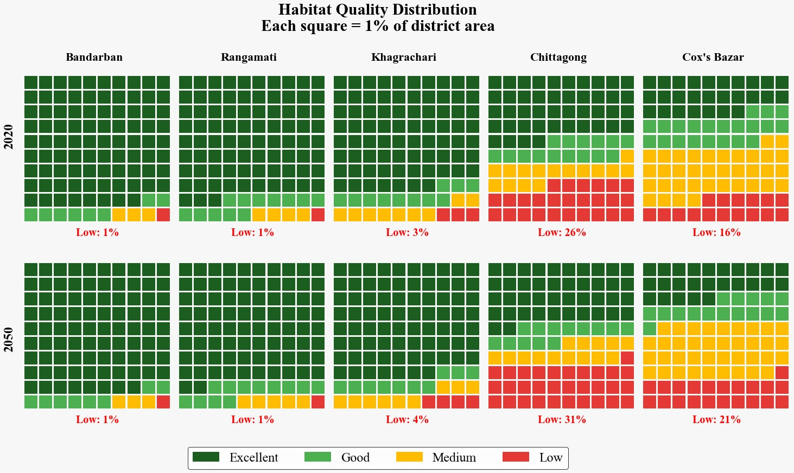

# LULC, Habitat Quality and Species Richness Visualizations

Python scripts and publication-style figures for visualizing land-use/land-cover (LULC), habitat quality, species richness, and land-use transitions.

## Figures

### 1. Habitat Quality: 2020 vs 2050



**Python code:** [`01_habitat_quality_2020_2050.py`](01_habitat_quality_2020_2050.py)

---

### 2. Species Richness by Land Use Type


**Python code:** [`02_species_richness_heatmap_radar.py`](02_species_richness_heatmap_radar.py)

---

### 3. Land Use Transfer Matrix


**Python code:** [`03_land_use_transfer_matrix.py`](03_land_use_transfer_matrix.py)

---

### 4. LULC Percentage Change: 2000–2050


**Python code:** [`04_lulc_percentage_2000_2050.py`](04_lulc_percentage_2000_2050.py)

## Repository structure

```text
LULC-Visualization/
│
├── README.md
├── requirements.txt
├── .gitignore
│
├── 01_habitat_quality_2020_2050.py
├── 02_species_richness_heatmap_radar.py
├── 03_land_use_transfer_matrix.py
├── 04_lulc_percentage_2000_2050.py
│
└── images/
    ├── 01_habitat_quality_2020_2050.png
    ├── 02_species_richness_heatmap_radar.png
    ├── 03_land_use_transfer_matrix.png
    └── 04_lulc_percentage_2000_2050.png
```

## Requirements

- Python 3.9+
- NumPy
- Matplotlib
- Seaborn

Install the dependencies:

```bash
pip install -r requirements.txt
```

## Run the scripts

```bash
python 01_habitat_quality_2020_2050.py
python 02_species_richness_heatmap_radar.py
python 03_land_use_transfer_matrix.py
python 04_lulc_percentage_2000_2050.py
```

Each script generates its corresponding PNG figure in the current directory.

## Data note

The values used in these figures are the values supplied with the original code. They are presented here as visualization inputs and should be interpreted according to the methodology and data sources of the associated research project.

## Citation

If you use these scripts or figures in an academic work, please cite the associated research/project and the original data sources where applicable.
